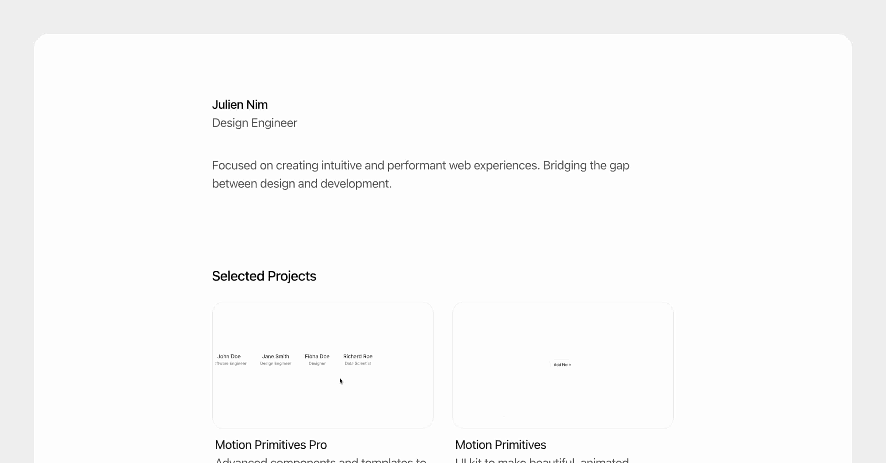

# 🍨 Rabeel Ashraf – Creative Developer & AI Enthusiast

**Rabeel.world** is a sleek, AI-ready, and fully customizable portfolio built with **Next.js 15**, **React 19**, **Tailwind CSS v4**, and **Motion UI**.  
Designed for impact, personal branding, and showcasing creativity through custom components and real-world projects.

Live demo: [https://rabeel.world](https://rabeel.world)

---

## 🧠 Features

- Personal brand portfolio layout  
- Blog system powered by MDX  
- 3D effects, spotlight interactions, and animated components  
- Customizable testimonials & contact section  
- Page-level SEO and OpenGraph support  
- Protected pages (`/work`)  
- Deployment via **Vercel** (free)

---

## 🚀 Getting Started

Clone the repo and run locally:

```bash
git clone https://github.com/rabeelashraf/My-Portfolio.io.git
cd My-Portfolio.io
npm install
npm run dev
